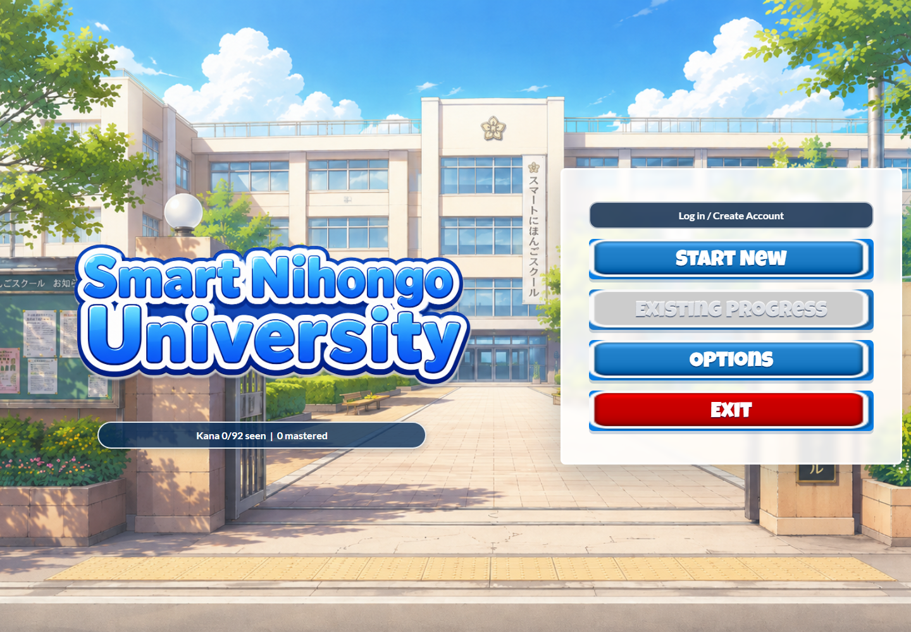
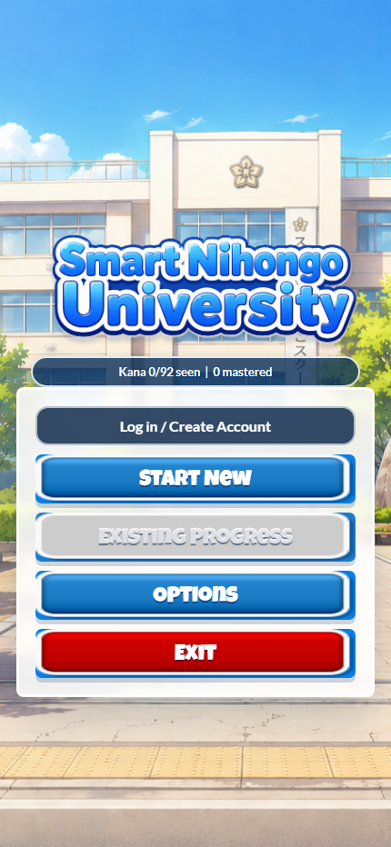

# Smart Nihongo

The production website for [smartnihongo.com](https://smartnihongo.com/), an interactive Japanese-learning experience built around selectable teachers, practical situations, spoken practice, and persistent progress.

## Live website

### Choose your teacher

Daichi, Sensei, and Gozo each present lessons with a different teaching personality and voice.

Mobile home screen

## Current learning experience

- Account registration and login with password hashing and secure sessions
- Local progress for guests and MySQL-backed progress synchronization for signed-in learners
- Teacher selection: Daichi, Sensei, or Gozo
- Experience-level selection followed by a learning-path choice
- Hiragana and katakana flashcards, study ratings, favorites, quiz mode, speech playback, and speaking practice
- Living in Japan situations with Vocabulary → Dialogue → Roleplay → Quiz → Life Skill Badge progression
- A complete restaurant learning sequence
- Casual-conversation lessons and response practice
- Learn by Immersion: a nine-exchange Narita Airport-to-Tokyo hotel lesson with Gozo, spoken dialogue, response choices, microphone support, and progressively harder subtitles
- Responsive desktop and mobile layouts

## Repository layout

| Path | Purpose |
| --- | --- |
| `web/` | Current production website mirrored from the live deployment |
| `web/assets/` | Production images, fonts, interface art, and teacher/kana audio |
| `web/auth.php` | Login and registration endpoint |
| `web/progress.php` | MySQL-backed progress endpoint |
| `site/` | Earlier ProcessWire theme retained for reference |
| `docs/screenshots/` | Screenshots captured from the live website |

The production database credentials are intentionally excluded. Both PHP endpoints read them from `web/private-config.php`, which is ignored by Git.

## Run locally

The front end needs an HTTP server because account and progress requests use PHP endpoints. Point a PHP-capable web server at `web/`, then open its root URL in a modern browser. The visual experience can be inspected without database access; login and cloud progress require a compatible private configuration and MySQL database.

## Production deployment

Deploy the contents of `web/` to the document root for `smartnihongo.com` over explicit FTPS. Keep the production `private-config.php` on the server and do not overwrite or commit it.

The current `web/index.html`, `web/app.js`, and `web/styles.css` were verified byte-for-byte against the live website before this repository update. Screenshots in `docs/screenshots/` were rendered directly from `https://smartnihongo.com/`.
